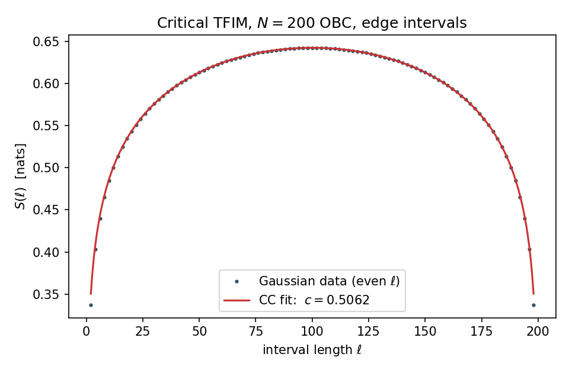

# Lou Thomas - Physics Research

An AI-assisted personal research collection on boundary-inversion cosmology, relational substrates, and quantum observation. It brings together manuscripts, numerical results, source code, and the limitations discovered during review.

**Author and project originator: Lou Thomas.** Please cite this repository when using its research, code, figures, or results. See [CITATION.cff](CITATION.cff) and [citation guidance](docs/CITATION.md).

**Research status:** exploratory and not peer-reviewed. The BIH-VI A2 result is a stability scan of a specified numerical instrument; its connection to the model's cubic action still requires independent derivation and expert review. The other projects have their own evidence and limitations. This collection does not establish a unified theory, an observational detection, or a solution to the Hubble tension.

## Start Reading

1. [Research overview](docs/RESEARCH_OVERVIEW.md): the strongest material, how the projects relate, and what remains open.
2. [BIH-VI](bih-vi/README.md): the background reports, final A2 manuscript, locked data, and foundation review.
3. [RNSF](rnsf/README.md): formal definitions and a lattice-model instrument tested against exact diagonalization.
4. [Foundations](foundations/README.md): selected conceptual manuscripts on light, observation, dimensional projection, and relational lattices.
5. [Historical demonstrations](experiments/conscious-physics/README.md) and [earlier versions](archive/README.md): retained for provenance, with explicit limitations.



Recorded RNSF Phase 1 figure. This is a lattice-model instrument check, not a measurement of the universe or evidence for BIH-VI.

## Verify And Reproduce

Python 3.12 was used to test this edition. The integrity check uses only the standard library:

```text
python tools/verify_release.py
```

For the supported numerical checks, create a virtual environment and install the recorded dependencies from `requirements.txt`, then run:

```text
python tools/reproduce_a2.py
python tools/reproduce_rnsf.py
```

These commands write only to a fresh directory beneath this repository's `_generated/` folder. They do not download data, upload results, or use the original author's local Hub. Read [reproduction details](docs/REPRODUCING.md) and [code review](docs/CODE_REVIEW.md) first. Installing dependencies is a separate, explicit network operation.

## What This Edition Changes

The October 7, 2026 collection (edition `2026.10.07.1`) consolidates recovered source files and removes byte-identical duplicates. It restores the accepted July 2026 A2 materials from matching backup copies. It adds a tighter reader's guide, credits, release verification, and isolated reproduction commands. Earlier numerical values and model assumptions are preserved.

Document metadata, personal paths, and contact details have been removed from public exports. Old notebooks with placeholder data are displayed as non-executing historical text. Legacy scripts are retained as `.py.txt` or `.ps1.txt` sources. [Version selection](docs/VERSIONS.md) and [source mapping](docs/SOURCE_MAP.csv) record the distinctions; this is a new distribution, not a byte-for-byte copy of the historical packages.

## Authorship, Use, And Licensing

AI systems contributed substantially to the mathematics, code, drafting, and review. Lou Thomas supplied the research direction and assembled the work. AI agreement is not independent scientific validation. See [AI disclosure](docs/AI_DISCLOSURE.md).

This is personal research. It is not an employer publication, professional engineering service, approved design method, or company-endorsed product. See [use and affiliation notice](docs/USE_AND_AFFILIATION.md).

Code is available under the [MIT License](LICENSE). Research documents, original figures, and copyrightable original data presentation are under [CC BY 4.0](LICENSES/CONTENT-LICENSE.md), to the extent the author holds the relevant rights. Third-party material retains its own terms. See [licensing and attribution](docs/LICENSING.md).

To upload this collection, follow [UPLOAD_TO_GITHUB.md](UPLOAD_TO_GITHUB.md). Upload the contents of this folder so this README appears at the repository root.
